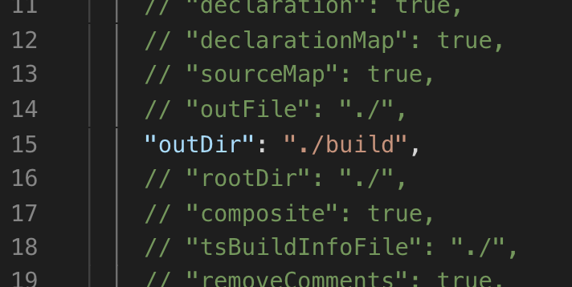

# Typescript Series - Lecture 1
## Setting up Typescript for an Express Project
(Consolidated information from [Medium Article by André Gardi](https://medium.com/javascript-in-plain-english/typescript-with-node-and-express-js-why-when-and-how-eb6bc73edd5d))

---
### Initial Setup

Start by initializing a Node project:

```
npm init
```

Now let's install `typescript` package:

```
npm install typescript -s
```

Note that the `-s` flag, is the exact same thing as using `--save`. 

---
### Setting up Node and Express with Typescript

Node.js is an engine that runs Javascript and not Typescript. The node Typescript package allows you to transpile your .ts files to `.js` scripts. Babel can also be used to transpile Typescript, however the market standard is to use the official Microsoft package.

Inside our `package.json` we will put a script called `tsc`:
```
  "scripts": {
      ...           <-- Other scripts you might already have
      "tsc": "tsc"  <-- Add this line
  },
```

This modification allows us to call typescript functions from the command line in the project’s folder. So we can use the following command:

```
npm run tsc -- --init
```

This command initializes the typescript project by creating the `tsconfig.json` file. Within this file we will uncomment the `outDir` option and choose a location for the transpiled .js files to be delivered:



---
Great! Now that we have Typescript setup, lets turn our attention to creating an Express server.

Head over to Terminal:
```
npm install express --save
```

Express and Typescript packages are independent. The consequence of this is that Typescript does not “know” types of Express classes. There is a specific npm package for the Typescript to recognize the Express types. Installing the package will make our Typescript aware of those types. In Terminal:

```
npm install @types/express -s
```

Create an `app.ts` file (note the `.ts` extention):

```typescript
// app.ts

import express = require('express');

// Create a new express application instance
const app: express.Application = express();

app.get('/', function (req, res) {
  res.send('Hello World!');
});

app.listen(3000, function () {
  console.log('Example app listening on port 3000!');
});
```

Of note, you will see the line `const app: express.Application = express();`

In Typescript, when you create a variable, you also have to specify what `type` the variable is. This means 
that the created variable is always that noted type and can never change type. This is considered to be 'strong typing', 
versus JavaScript's 'weak typing'. In JavaScript, variables can change type through re-assignment. While this may seem
like a strength in some ways, it makes JavaScript difficult to debug in some cases. More on this later.

---
### Building our Application

Now that we have a Typescript file built, let's run the command to convert it from Typescript to JavaScript. 

```
npm run tsc
```

This creates a `build` directory in our projects route. Inside, we will find our newly minted `.js` file. From there, we can
run the `.js` file like any other node file:

```
node build/app.js
```

Boom! Server is up and running!
